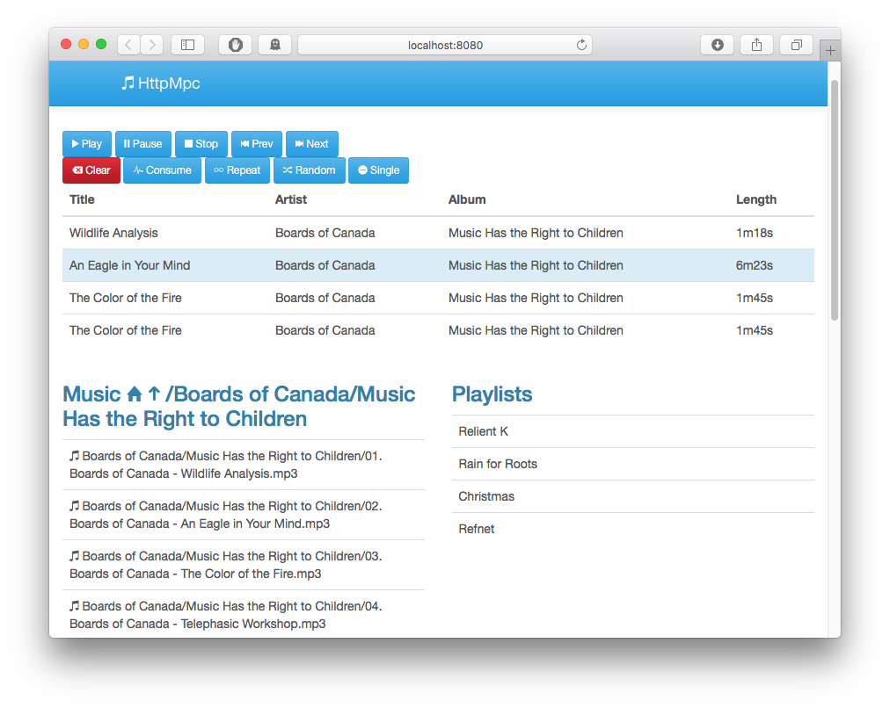

# httpmpc
A HTTP MPD client with some thought for mobile clients.

# What is it
This is another daemon that run along side MPD that exposes much of the common functionality MPD is capable under HTTP routes, and serves out a built in webpage that can be used to control your favorite music without the need to install a Desktop client (mpc, iOS, etc)

# Huh?  Why would you do this?
I have several MPD instances running in various places around my house, and I have yet to find a good app for my mobile / desktop that can handle multiple MPD instances gracefully.  However, just about every machine DOES have a capable web browsers.  Likewise, one of these instances runs on a raspberrypi, which is quite underpowered, and I dont want ot bog it down with a standard LAMP stack which is needed for other Web interfaces.

# How to install it

Since this is all written in GoLang this is REALLY straight-forward:
```sh
    #get the go library and deps
    go get -u "github.com/npotts/httpmpc"
    go get -u "github.com/GeertJohan/go.rice/rice"

    cd $GOPATH/src/github.com/npotts/httpmpc && rice embed-go

    #build needed binaries
    go get -u "github.com/npotts/httpmpc/httpmpc"

    #Installation w/ static binaries - HTML is bundled in with executable
    cp $GOPATH/bin/httpmpc /usr/local/bin
    cp $GOPATH/src/github.com/npotts/httpmpc/httpmpc/httpmpc.yml /etc

    #edit config file
    nano/vi/subl /etc/httpmpc.yml

    #start daemon
    httpmpc 
```

If you want to cross-compile, you should only need to do something like the following (which will build it for a raspberrypi):

```sh
    GOOS=linux GOARCH=arm go get -u "github.com/npotts/httpmpc/httpmpc"

    #binary
    ls $GOPATH/bin/linux_arm/httpmpc
```


# Config file

The 'stock' one is located at $GOPATH/src/github.com/npotts/httpmpc/httpmpc/httpmpc.yml and is dead simple:
```yml
    --- 
    #MPD instance, in server:port form.  Standard port is 6600
    MPD: 192.168.42.74:6600

    #Password, if required, to connect
    Password:

    #Which HTTP port to listen on
    HTTP Port: 8080

    #Keep Alive is how long we should wait (in ms)  when polling the MPD server to keep the connection Alive
    Keep Alive: 1000
```

# Screenshots




# License / Author
This software is Licensed under the MIT License (MIT) and is Copyright (c) 2016 by Nick Potts.
    
    The MIT License (MIT)

    Copyright (c) 2016 Nick Potts

    Permission is hereby granted, free of charge, to any person obtaining a copy
    of this software and associated documentation files (the "Software"), to deal
    in the Software without restriction, including without limitation the rights
    to use, copy, modify, merge, publish, distribute, sublicense, and/or sell
    copies of the Software, and to permit persons to whom the Software is
    furnished to do so, subject to the following conditions:

    The above copyright notice and this permission notice shall be included in all
    copies or substantial portions of the Software.

    THE SOFTWARE IS PROVIDED "AS IS", WITHOUT WARRANTY OF ANY KIND, EXPRESS OR
    IMPLIED, INCLUDING BUT NOT LIMITED TO THE WARRANTIES OF MERCHANTABILITY,
    FITNESS FOR A PARTICULAR PURPOSE AND NONINFRINGEMENT. IN NO EVENT SHALL THE
    AUTHORS OR COPYRIGHT HOLDERS BE LIABLE FOR ANY CLAIM, DAMAGES OR OTHER
    LIABILITY, WHETHER IN AN ACTION OF CONTRACT, TORT OR OTHERWISE, ARISING FROM,
    OUT OF OR IN CONNECTION WITH THE SOFTWARE OR THE USE OR OTHER DEALINGS IN THE
    SOFTWARE.

#TODO / Bugs
Pull Requests are welcome.  The UI is still ongoing with enhancements, and as that is not my forte, I am more than willing to make and accept edits to make it better.

1. Better handling of config files
1. UI improvements
1. Volume Control
1. Progress bar position control
